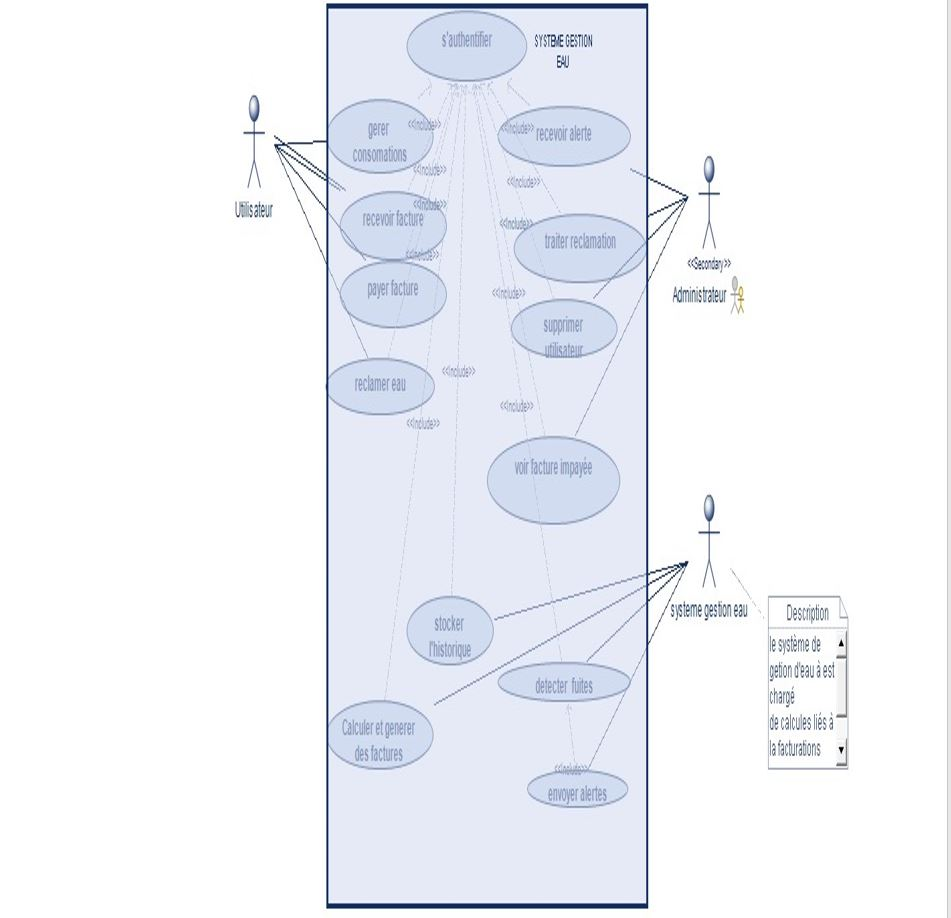
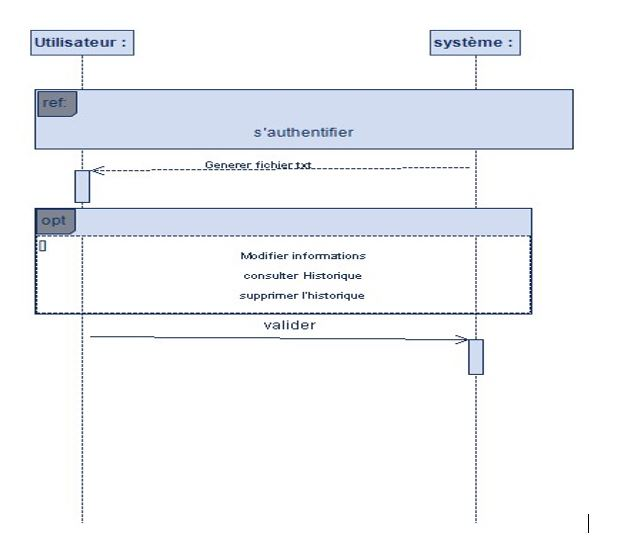
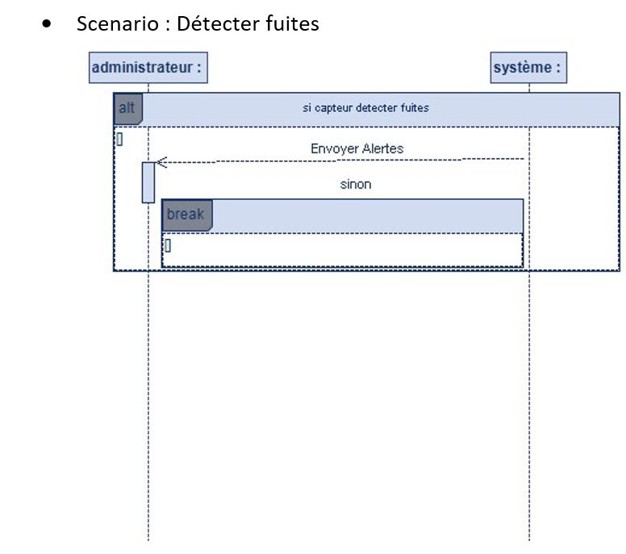
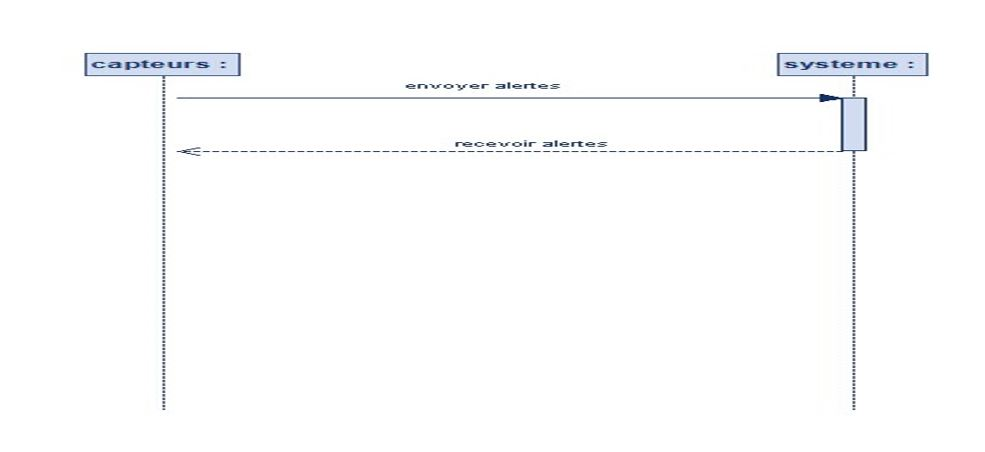
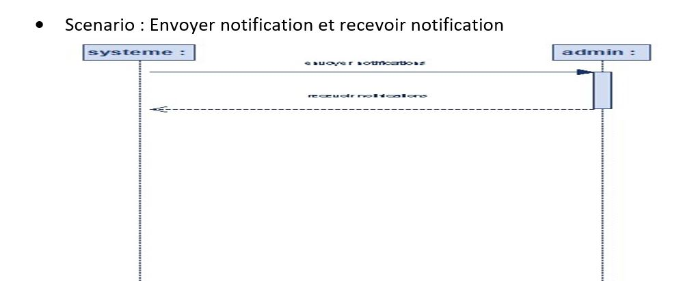
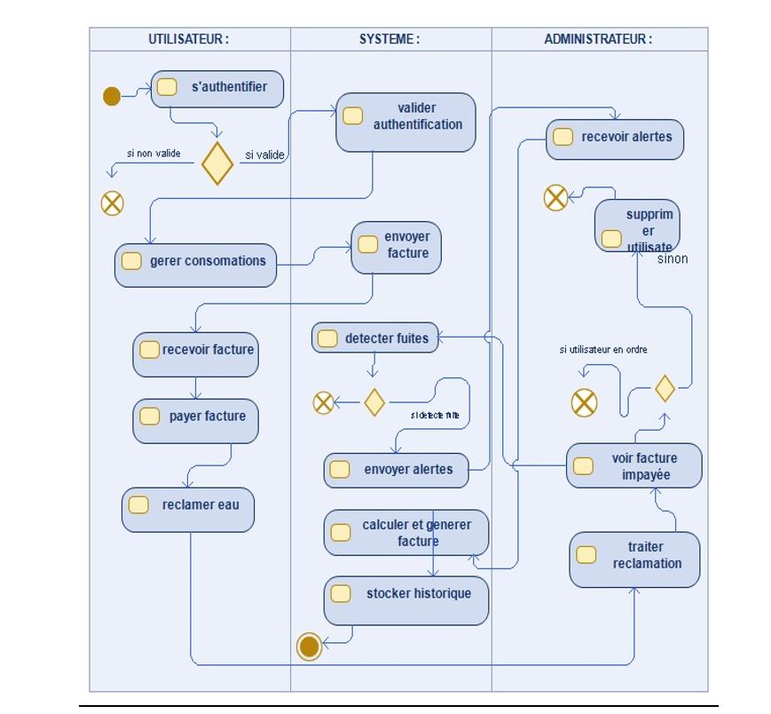

<!DOCTYPE html>
<html>
<head>
  <title>Système de Fourniture et de Facturation Automatique d'Eau</title>
  
</head>
<body>
  <header>
    <h1>Système de Fourniture et de Facturation Automatique d'Eau</h1>
  </header>
  <main>
    <section>
      <h2>Membres du Groupe</h2>
      <table>
        <tr>
          <th>Nom</th>
          <th>Spécialité</th>
        </tr>
        <tr>
          <td>BASHIMBE TCHISHUGI DIEUDONNE</td>
          <td>MSI</td>
        </tr>
        <tr>
          <td>BUJIRIRI LINDA LAURENE</td>
          <td>MSI</td>
        </tr>
        <tr>
          <td>ISALA KAMINA TATIANA</td>
          <td>MSI</td>
        </tr>
        <tr>
          <td>ISESA FATUMA GLOIRE</td>
          <td>GL</td>
        </tr>
        <tr>
          <td>ILUNGA KASANI NARCISSE</td>
          <td>GL</td>
        </tr>
        <tr>
          <td>KABWIT MUJING BENITA</td>
          <td>GL</td>
        </tr>
        <tr>
          <td>KUNDA KEFE CHANCELLE</td>
          <td>MSI</td>
        </tr>
        <tr>
          <td>KYUNGU BANZE RITA</td>
          <td>MSI</td>
        </tr>
        <tr>
          <td>NTAMBWE MUKONKOLE HAMMIELL</td>
          <td>MSI</td>
        </tr>
        <tr>
          <td>TSHITEYA NDAYA YVES</td>
          <td>MSI</td>
        </tr>
      </table>
    </section>
    <section>
      <h2>Résumé du Projet</h2>
      
Notre projet consiste à concevoir un système innovant de fourniture et de facturation automatique d'eau visant à optimiser la distribution de l'eau potable et à simplifier le processus de facturation pour les résidents.

    </section>
    <section>
      <h2>Introduction</h2>
      
L'accès à une fourniture en eau fiable et un processus de facturation efficace sont des éléments essentiels pour le bon fonctionnement d'une ville. Les problèmes à résoudre sont le gaspillage d'eau, la surconsommation d'eau et une facturation qui n'est pas précise et équitable.

    </section>
    <section>
      <h2>Matériels Utilisés</h2>
      <ul>
        <li>Capteurs de débit (Flow Sensors) : Capteur de débit YF-S201</li>
        <li>Carte Arduino</li>
        <li>Module de communication : Module Wi-Fi (ESP8266 ou ESP32) pour la connectivité Internet</li>
        <li>Alimentation électrique : Batterie rechargeable pour les installations autonomes</li>
        <li>Câblage et fil de connexion</li>
        <li>Capteur d'humidité</li>
      </ul>
    </section>
    <section>
      <h2>Schéma et Diagramme Explicatif</h2>
      <h3>Diagramme de Cas d'Utilisation</h3>
      
      <h3>Diagrammes de Séquence</h3>
      <h4>Scénario : S'inscrire</h4>
      
      <h4>Scénario : S'authentifier</h4>
      
      <h4>Scénario : Détecter Fuites</h4>
      
      <h4>Scénario : Gérer Historique</h4>
      
      <h4>Scénario : Envoyer Alertes</h4>
      
      <h4>Scénario : Envoyer et Recevoir des Notifications</h4>
      
      <h3>Diagramme d'Activité</h3>
      
    </section>
    <section>
      <h2>Étapes du Développement</h2>
      
Les principales difficultés rencontrées lors du développement sont :

      <ul>
        <li>Intégration des différents composants (capteurs, modules de communication, etc.)</li>
        <li>Développement de l'interface utilisateur conviviale</li>
        <li>Implémentation des algorithmes de détection de fuites et de facturation automatique</li>
      </ul>
    </section>
    <section>
      <h2>Résultat</h2>
      
Le système de fourniture et de facturation automatique d'eau développé permet d'optimiser la distribution de l'eau potable et de simplifier le processus de facturation pour les résidents de la ville. Les principaux résultats obtenus sont :

      <ul>
        <li>Réduction du gaspillage d'eau grâce à la détection rapide des fuites</li>
        <li>Facturation précise et équitable basée sur la consommation réelle de chaque utilisateur</li>
        <li>Amélioration de la satisfaction des résidents avec un service plus fiable et transparent</li>
      </ul>
    </section>
    <section>
      <h2>Références</h2>
      
Voici les principales références utilisées pour ce projet :

      <ul>
        <li>Documentation technique des composants électroniques (capteurs, modules de communication, etc.)</li>
        <li>Ressources en ligne sur la conception de systèmes IoT pour la gestion de l'eau</li>
        <li>Études de cas et bonnes pratiques dans le domaine de la fourniture et de la facturation automatique d'eau</li>
      </ul>
    </section>
  </main>
</body>
</html>
